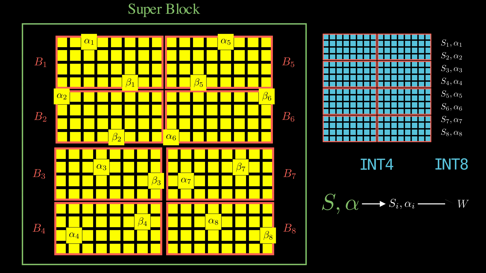

# K-Quants

## Overview

K-quants are the second generation of quantization algorithms in `llama.cpp`. They build upon [legacy quants](legacy-quants.md) by introducing a deceptively simple but powerful solution: **quantize the quantization constants themselves**.

The key innovation is **double quantization**, introduced by [QLoRA](https://arxiv.org/abs/2305.14314). Instead of storing quantization constants in full precision, K-quants quantize them too, creating a two-level hierarchical quantization scheme that dramatically reduces storage overhead.

## What does the K stand for?
Despite common misconceptions online, the "K" in K-quants does **NOT** stand for [*K-means clustering*](https://en.wikipedia.org/wiki/K-means_clustering) (which is a form of *vector* quantization). K-quants use the same affine quantization as [legacy quants](legacy-quants.md), not vector quantization.

The "K" most likely comes from [Kawrakow](https://github.com/ikawrakow) (the developer who wrote K-quants) or "kernels" (since new CPU kernels were added to handle super-blocks, discussed in the next section).

## Super-blocks and Double Quantization

[Legacy quants](legacy-quants.md) require quantization constants (scale and optional offset) for each block of 32 weights. For a 16B parameter model, these constants consume about 2GB of storage on top of the quantized weights. K-quants reduce this overhead.

K-quants group 8 regular blocks into one **super-block**, creating a two-level hierarchy:

1. **Regular blocks**: Still contain 32 quantized weights each (e.g., INT4)
2. **Block constants**: Scale and offset for each regular block, now stored as INT8 (quantized!)
3. **Super-block constants**: One pair of FP16 constants to dequantize the block constants

For a 16B-parameter model, this reduces storage overhead from 2GB to ~1GB.

## Super-blocks and Memory Efficiency

Beyond storage savings, super-blocks provide crucial **memory access optimizations**. Reading small scattered 32-element blocks leads to poor cache line utilization. Grouping blocks into super-blocks enables sequential memory reads and enable better memory bandwidth utilization.

## Mixed Precision Strategy

K-quants implement **mixed precision** quantization: not all weights get quantized to the advertised bit width. Critical components receive higher precision:

- **Layer normalization weights**: Often kept in FP16
- **Attention weights**: Allocated higher precision (`Q5_0`, `Q6_K`, etc.)
- **Output layer**: May use higher precision than base quantization

The size modifiers (S/M/L) control this precision allocation strategy:
- **S (Small)**: More aggressive, smaller files
- **M (Medium)**: Better quality, larger files  
- **L (Large)**: Highest quality, largest files (where available)

---
[← Back: Legacy Quants](legacy-quants.md) | [Next: I-Quants →](i-quants.md)