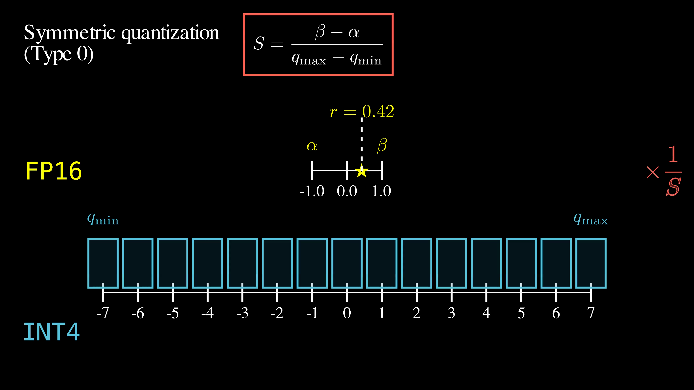
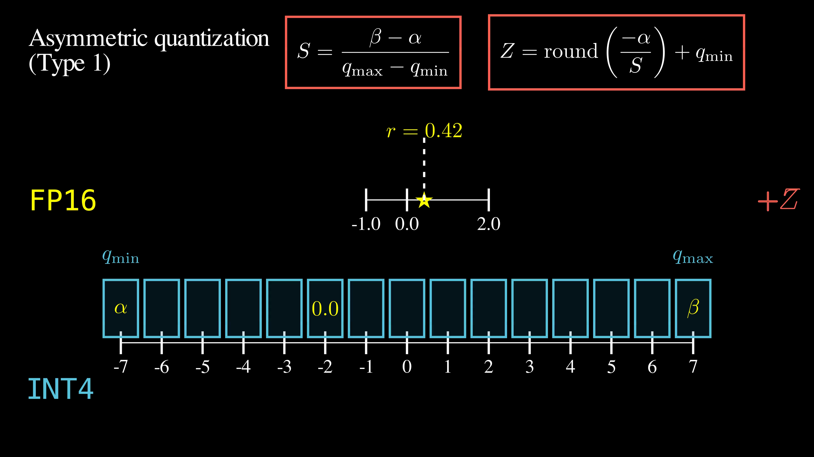
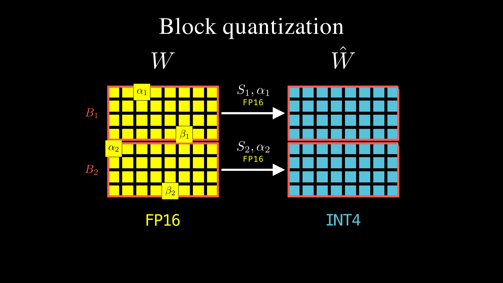

# Legacy Quantization Methods

## Overview

Legacy quantization methods are the first generation of quantization algorithms in `llama.cpp`. Even though they are deprecated as standalone quantization methods, they remain relevant because their successors ([K-quants](k-quants.md) and [I-quants](i-quants.md)) build upon them rather than replace them entirely.

Legacy quants use **affine quantization**, mapping each floating-point scalar weight to a lower-bit integer.

## Quantization Types

Legacy quants come in two main subcategories that correspond to symmetric and asymmetric quantization:

- **Type 0** (symmetric): `Q4_0`, `Q5_0`, `Q8_0`  
- **Type 1** (asymmetric): `Q4_1`, `Q5_1`, `Q8_1`

The `Q` in the naming convention indicates the bit width - for example, `Q4` means (most) weights are stored as 4-bit integers. The `_0` and `_1` suffixes indicate the type.

### Type 0 (Symmetric Quantization)

Type 0 quantization uses **symmetric quantization**: it assumes the weight range is symmetric around zero.

Here is how `Q4_0` quantization works.
- **Model weights** (originally in FP16) are clipped to a fixed interval. In the example above, the clipping range is given by α = -1 and β = +1 (a *symmetric interval*).
- **Integer bins**. Each weight will be quantized to a 4-bit integer. Even though 4 bits can represent 16 values (-8 to +7 for INT4), the leftmost value is dropped. An odd number of bins allows the middle one to act as a zero, with an equal number of bins on each side.
- **Scale**. We compute the scale `S = (β - α) / (max_int - min_int)`, which is the relative width of the real and integer spaces.
- **Quantization**. To quantize a real value `r`, we simply scale it: `quant(r) = round(r/S)`. The rounding operation is lossy (so we'll never be able to recover the exact value of `r`).
- **Storage**. In the quantized checkpoint, instead of storing `r`, we'll store its INT4 bin `quant(r)` and the scale `S` (in FP16). The scale is shared across multiple weights, so its storage cost is amortized (see [Block Quantization](#block-quantization)).

**The Symmetry Problem**: When weights don't actually span symmetrically (e.g., -1 to +2), Type 0 "fakes symmetry" by pretending the range goes from -2 to +2. This wastes bins in the unused region (-2 to -1).

### Type 1 (Asymmetric Quantization)

Type 1 quantization uses **asymmetric quantization**: it uses integer bins more effectively, even when the weight clipping range is not symmetric (e.g. [-1, +2]).

- **Zero point**. We compute the zero point `Z = round(-α/S) + min_int`, which is the bin that should house the floating point zero value. [This video timestamp](https://youtu.be/qoQJq5UwV1c?t=729) explains its derivation.
- **Quantization**. While Type 0 quantization is a single *scale*, Type 1 quantization first performs a *shift* (by `Z`), then a *scale* (by `S`): `quant(r) = Z + round(r/S)`.
- **Storage**. For an original weight `r`, GGUF stores: (a) its INT4 bin `quant(r)`, (b) the scale `S`, and (c) `α` (called "min" or "offset"), from which `Z` can be easily deduced. The additional `α` increases storage requirements to boost precision. Again, `S` and `α` (collectively referred to as "quantization constants") are shared across multiple weights, so their storage cost is amortized (see [Block Quantization](#block-quantization)).

## Block Quantization

Storing separate high-precision quantization constants `S` (and `α` for Type 1) for each weight would defeat the purpose of quantization. Instead, GGUF uses *block quantization* (a technique as old as signal processing).

Weights are grouped into fixed-size blocks (16 or 32 for GGUF). The block size is like a knob:
- high block size => fewer blocks => fewer constants => less storage, less precision
- low block size => more blocks => more constants => more storage, more precision

For a 16B parameter model with block size 32, Type 1 quantization constants require about 2GB of storage on top of the quantized weights.

---
[← Back to Main](README.md) | [Next: K-Quants →](k-quants.md)