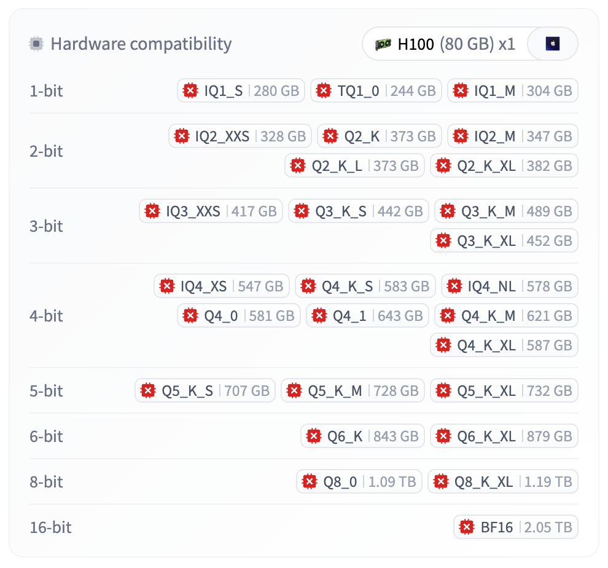
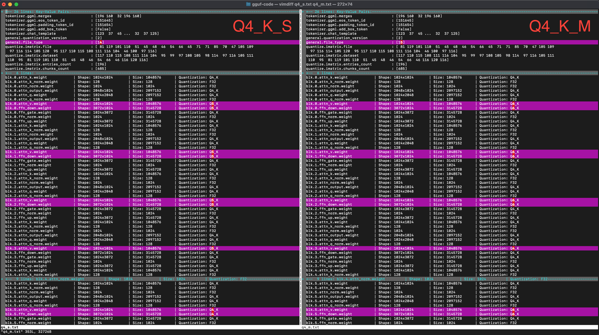

# Naming Convention

## Overview

GGUF quantization algorithms follow a systematic(ish) naming convention that helps identify the quantization methodology, as well as gauge the compression rate. Here are some examples:

## 1. The quantization algorithm version
- [Legacy quants](legacy-quants.md): End in `_0` or `_1` (e.g., `Q4_0`, `Q4_1`)
- [K-quants](k-quants.md): Include the letter `K` in the name (e.g., `Q4_K`).
    - Most likely, `K` stands for [Kawrakov](https://github.com/ikawrakow), the name of the developer who implemented them.
    - `K` does NOT stand for [K-means clustering](https://en.wikipedia.org/wiki/K-means_clustering), which is a common misconception online.
- [I-quants](i-quants.md): Include the letter `I` in the name (e.g., `IQ1`).
    - Most likely, `I` stands for "importance"

## 2. The bit width
The `Q` part tells us the **bit width** - the number of bits used to store (most) weights:

- `Q4` = 4 bpw
- `Q5` = 5 bpw  
- `Q6` = 6 bpw
- `Q8` = 8 bpw

For [I-quants](i-quants.md), the bit widths are approximate:
- `IQ1` = ~1 bpw
- `IQ2` = ~2 bpw
- `IQ3` = ~3 bpw
- `IQ4` = ~4 bpw

This is because I-quants do *vector quantization*, which stores N weights into an M-bit code. The amortized compression rate is N/M bpw, which might not be an integer.

## 3. The size modifier
Currently, LLMs get quantized with *mixed precision*, i.e. not all weights use the same bit widths. Parameters fall in one of three categories:

1. Quantized to the bit width indicated by `Q`;

2. Not quantized / kept in full precision (e.g. token embeddings, [LayerNorm](https://docs.pytorch.org/docs/stable/generated/torch.nn.LayerNorm.html) weights);

3. Quantized to some middle bit width (hand-picked by the `llama.cpp` authors).

The size modifier in the filename (`S`, `M`, `L`, `XL`) is a rough indication for the precision used for the third category of weights.

For instance, the screenshot below compares `Q4_K_S` (left) against `Q4_K_M` (right); we'll discuss the meaning of `K` below. The parameter `blk.0.attn_v.weight` was quantized to `Q5` in the `S` version (left) and `Q6` in the `M` version (right).

So far, `llama.cpp` has seen three major generations of quantization algorithms:

1. **[Legacy quants](legacy-quants.md)** - First generation
2. **[K-quants](k-quants.md)** - Second generation  
3. **[I-quants](i-quants.md)** - Third generation

Each generation contains multiple versions, and there's a clear naming convention that helps distinguish them.

## Naming Pattern

### Generation Identifiers

- **Legacy quants**: Usually end in `_0` or `_1` (e.g., `Q4_0`, `Q4_1`, `Q5_0`, `Q5_1`, `Q8_0`, `Q8_1`)
- **K-quants**: Include the letter `K` in the name (e.g., `Q4_K_S`, `Q4_K_M`, `Q5_K_S`, `Q6_K`)
- **I-quants**: Include the letter `I` in the name (e.g., `IQ1_S`, `IQ2_XXS`, `IQ3_M`, `IQ4_NL`)

### Bit Width

The `Q` part tells us the **bit width** - the number of bits used to store (most) weights:

- `Q4` = 4-bit quantization
- `Q5` = 5-bit quantization  
- `Q6` = 6-bit quantization
- `Q8` = 8-bit quantization

For I-quants, the pattern is slightly different:
- `IQ1` = ~1 bit per weight
- `IQ2` = ~2 bits per weight
- `IQ3` = ~3 bits per weight
- `IQ4` = ~4 bits per weight

### Size Modifiers

Some quantization methods include size modifiers that indicate precision allocation across different parts of the model:

- `S` = Small (more aggressive quantization)
- `M` = Medium (balanced approach)
- `L` = Large (more conservative quantization)
- `XS` = Extra Small
- `XXS` = Extra Extra Small

For example, `Q4_K_S` uses more aggressive 4-bit quantization compared to `Q4_K_M`.

## Examples

Here are some common quantization method names broken down:

- `Q4_0`: Legacy 4-bit symmetric quantization
- `Q4_1`: Legacy 4-bit asymmetric quantization  
- `Q4_K_S`: K-quant 4-bit small variant
- `Q4_K_M`: K-quant 4-bit medium variant
- `Q6_K`: K-quant 6-bit variant
- `IQ2_XXS`: I-quant ~2-bit extra extra small variant
- `IQ3_M`: I-quant ~3-bit medium variant

## What the Letters Stand For

- **K in K-quants**: Most likely named after Kawrakow, the developer who submitted the K-quants pull request. Could also stand for "kernels" since new CPU kernels were implemented. It does **not** come from K-means clustering (a common misconception online).

- **I in I-quants**: Most likely stands for "importance" as in [importance matrix](importance-matrix.md), which was introduced alongside I-quants (though the importance matrix concept can be applied to other quantization methods as well).

---
[← Back to Main](README.md)